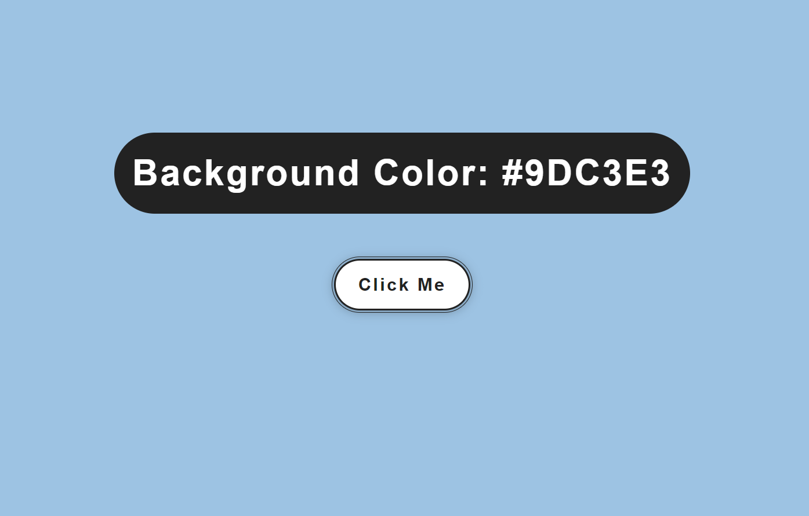

# Color Flipper

A simple Color Flipper app that changes the background color to a random color each time you click a button. This app is built with **HTML**, **CSS**, and **JavaScript** to create an interactive and fun user experience.

## Features

- **Random Color Generation**: Every click generates a new, random color.
- **User-Friendly Interface**: Simple design and easy-to-use button for color flipping.
- **Color Code Display**: Shows the hex code of the current background color.

## Demo

Check out the live demo of the project [here](https://sanskargupta0.github.io/Color-Flipper/).




## Installation and Setup

1. Clone the repository or download the source code:
    ```bash
    git clone https://github.com/Sanskargupta0/Color-Flipper.git
    ```

2. Navigate to the project folder:
    ```bash
    cd color-flipper
    ```

3. Open `index.html` in your web browser:
    ```bash
    open index.html
    ```

## Usage

- **Change Background Color**: Click the "Flip Color" button to change the background color to a randomly generated color.
- **Color Code Display**: The app will display the hex code of the current color, so you know exactly which color is being shown.

